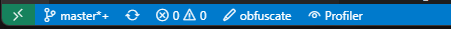
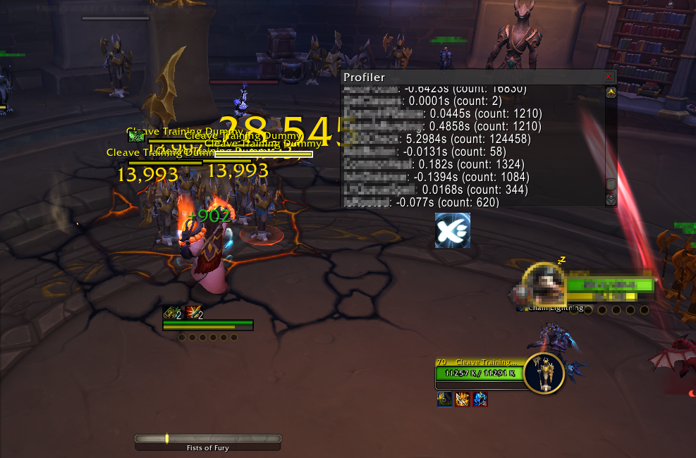

# Wow Lua Performance Profiler

Basic tool to visualize LuaObfuscator profiler data collected during runtime in-game.

## 💡 Usage

Use the [VSCode plugin](https://marketplace.visualstudio.com/items?itemName=ferib.lua-obfuscator) ~~(or website)~~ and inject 'Profiler' into the current Lua script. 

Load the script in World of Warcraft _(with this AddOn installed + enabled)_ and the GUI should populate itself in a certain interval.

## 🚀 Example

## ⚠️ TODO
- Add Profiler to website
- Add commands to hide/show enable/disable
- Use list-like items + variables instead of textbox